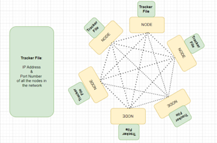
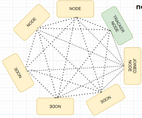
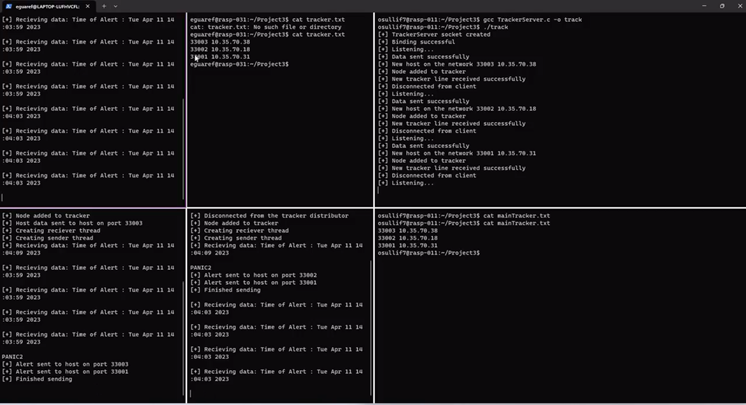

# Project 3 - Community Panic Alert System

### by Fiona Eguare, Fionnán O'Sullivan, Aaron McCann & Santosh Venkataraman (Group 11)

This README contains the setup, compilation and testing guidelines for our project 3 submission. In short, our idea is to provide a service that allows civilians to alert those around them if they feel that they are in danger.
This program is written in C and makes use of basic C libraries as listed below. Enjoy!!!

## Summary of Strengths and Beneficial Features from Project 2 Knowledge:
The project 2 completed by Aaron and Fionnan was a TCP peer-to-peer file sharing network. The integrity of the network came from a public distributed ledger. The ledger held a blockchain with each block representing a node storing data in the network. When the node was storing data, a block would be mined and placed into the distributed ledger. Then when a node was retrieving data from the network, they hashed the contents and compared it against the data held in the distributed public ledger, ensuring the data had not been tampered with. The strengths of our project 2 were its distributed nature, its accessibility, its non-reliance on infrastructure and its adaptability. 
•	Distributed: The strength of the network lay in the ledger, which each node had an ever-updating copy of. This means that data security can be validated against this public record, making it very hard for nodes to tamper with the data and it go unnoticed.
•	Accessibility: Any node was free to join or leave when it wanted to. Every time a node joined, they would get a newly updated copy of the ledger, making the network very accessible. 
•	Non-reliant on Infrastructure: No central server was needed; all interactions were between nodes. This was ideal for the use case since central servers may be targeted in attacks.

On completion of the project, we gained a solid foundation in TCP socket programming in Python, networking protocols, knowledge of the benefits of peer-to-peer networks such as their robustness to attacks, their distributed nature, their non-reliance on a central server. We also learned of the difficulty that can come with designing a peer-to-peer network. Nodes may fail at any time, there are security concerns that come with all nodes having similar privileges and the network topology is constantly changing. 
Fiona and Santhosh’s project 2 was a UDP based, peer-to-peer community alert system designed and implemented in C. All nodes in the network could act both as clients and servers, allowing them to send alerts to and receive alerts from all other hosts in the network without the need for an intermediary, as in the case of a centralized network. Our UDP implementation reduced network latency, which is crucial in an efficient emergency alert system, making it suitable for our use case. The functions for sending and receiving alerts, worked concurrently using pThreads making the program robust and avoiding network congestion. UDP was chosen primarily because of our least privilege approach of sending and receiving small, precise and important packets of data. The strengths of this implementation can be identified as follows: 
•	Low level implementation and simplicity: We implemented this application in C using few of its standard header libraries. This poses as a major advantage as on scaling this system, we will have faster processing, better control over resources such as memory and disk usage. 
•	Adaptability and flexibility: This architecture can and will be altered to allow multiple hosts to send and receive alerts with a real time updated tracker file. 
•	Least privilege approach: Minimal but crucial data packets are sent across the network, which fits the use case perfectly and minimizes the need for security.
•	Unique selling points: While there are other SOS apps available, they don’t offer the community security benefit that our network would. 

On completion of this project, we had a stronger understanding of many of the concepts we learned theoretically in the Computer Networks module by gaining hands on experience with socket programming with C, its associated libraries, concurrency, and explored different protocols to use UDP as the appropriate choice. 

## Aspect / facet of the situation and its needs and requirements
In combining our project 2’s, we decided to focus on the use case of a community alert system. Our goal was to design an improved version of our project 2 system, making use of our joint networking ability. We aimed to build a network that would allow for the increased peace of mind of civilians living in conflict zones by allowing them to send alerts to, and receive alerts from those in their community when danger arises. With this in mind, we found that speed, simplicity, and flexibility were high priority needs. These needs shaped our ideation and focus as we built our network. For example, while many of us take a reliable network connection for granted, this is not always a given in conflict zones. This meant that for our network design to be suitable, we needed to ensure it wasn’t based on the assumption of a reliably stable network connection. 

## Network and communication:
We decided to employ the UDP for the alert communication on our network. Its connectionless nature was better suited to our use case since when an alert is sent, it is sent to every node in the network. If the UDP packets don’t reach every node (a likely occurrence), this is compensated for by the volume of nodes panic messages are sent to. This ties into our model of sending an alert of higher severity, where multiple alerts are sent to each node. The gauge of how severe the danger is can be judged by the volume of alerts received. Furthermore, if an event is affecting many people, multiple hosts will be sending alerts, again reducing the likelihood that a user will not be notified of immediate danger. This risk is worth the benefits that UDP offers. When a node joins the network a TCP connection is established between the tracker distributor and the joining node, so the joining node can get the tracker file containing all the updated IP and port numbers of other nodes in the network. This allows the node to establish connection with nodes in the network and exchange data directly. TCP is important here as without the tracker file, the node is effectively not part of the network. This combination of network protocols complements each other well, the benefits of each being used where they are most appropriate.

## Prerequisite knowledge and skills: 
The knowledge that we needed to implement our project 3 was how the use of the older 32-bit version of Linux would affect what we could implement. For example, we had planned to implement geographical coordinates into our panic alert system, noting nodes of where the panic alert was coming from. We quickly found that using the necessary API would not be compatible with the 32- bit version of Linux. The knowledge of what we could and couldn’t use was quickly identified before we began investing time into coding. We also needed to be skilled in. git. When working in pairs it was possible to work on a code base and simply share updates by message / file sharing applications. For working in a group of four we needed a better code management system. To do this we used a git repo to all collaborate on a single code base. Regular commits were made and each feature we implemented was first tested on its own branch before merging.

## Agreed solution:
Our solution / combination of our project 2’s was a peer-to-peer panic alert system. The alert system would use a UDP messaging protocol and would also incorporate a TCP file sharing protocol that would distribute and constantly update a tracker file that would keep the contact information of all the nodes in the network. With this idea we would use the framework of the panic alert system from Fiona and Santhosh’s project 2, while also using the knowledge Fionnan and Aaron had developed from creating the TCP file sharing system to create an affective and applicable project 3. In our theorized solution, each node would keep a copy of the tracker file. This tracker file would have the IP address and port number of all the other nodes in the network. Whenever a node wanted to send a panic alert, it would be sent to each of the nodes that are held in the tracker file

Another feature of our solution is that when each panic alert is sent, the IP address and port number of the sending node will be added to each of the receiving nodes. This will increase the connectivity of the network, as each node will have more contact with other nodes. Lastly, we wanted to implement a panic alert scale. For more severe / dangerous scenarios, nodes would be able to send an alert that warranted more attention due to their higher status. For example, if there was an unexpected bombing, a node could send a panic-2 alert whereas if there were new military personnel spotted occupying a region, a node may only send a panic-1 alert. The severity of the alert is determined by the volume of alerts received. When a more severe alert message is sent, the node sends the UDP packet 4 times instead of 1. 

## Planning and Execution of test cases and validations:
To ensure the network was working as intended, we implemented the following test cases. To ensure that multiple hosts could join the network and receive the necessary tracker data we connected as many hosts as we could to the network. We found that the program performed as expected regardless of the number of hosts on the network. This also confirmed that the program could correctly parse the tracker file and get the necessary host data. While there is likely a point at which the number of hosts on the network will affect its function, we could not reach this point with the resources available to us. In practice, if this was to become an issue, the network could be extended so that different tracker distributors could serve different hosts. This would suit the implementation of the network as it is a community-based network, so each community could have access to a shared tracker-distributor. 
Another test-case we thought to be important was testing how the network would behave if the tracker distributor, or one of the other hosts disconnected unexpectedly. To test this, we tried connecting to the network both before the tracker distributor was running, and while it was disconnected mid-run. In both cases, any hosts that tried to join the network received a message to inform them that the connection was not successful, however in the second case, host that were already on the network were able to continue communicating un-affected. When a host that wasn’t the tracker distributor disconnected mid-run, the program simply continued as it was. Upon reconnecting, either on the same port or a new port, the node received an updated copy of the tracker distributor and was able to continue as normal. This means that the network is relatively unaffected by unexpected drops in connection, enhancing its distributed nature and making it well suited for the use case, in which a steady internet connection is not a given. 
Our final test case was to examine how the program handles duplicate hosts. If a host was taken to be a new node every time it reconnected to the network, many excess duplicates host lines would build up in the tracker file over time, especially in the scenario of an unstable network connection. This would not necessarily stop the network from functioning, but as this number increases, it would likely slow down the function of the network and reduce its effectiveness as there would be an increasing amount of traffic. To prevent this, the tracker distributor checks to ensure that a host is not already present in the tracker file before adding it. Duplicate hosts still receive the master-tracker file from the distributor as it is possible that new hosts will have joined while they were disconnected. This combination of an initial TCP connection and a majority UDP network allows for the necessary reliability, without losing out on the speed, flexibility, and low sensitivity of UDP that benefits the network.


## Value and importance of solution: 
Our implementation of the community panic alert system can be utilized for a range of use cases. During natural calamities, militant activities etc. This proves the extent to which our application can be adapted and scaled. Our primary objective was to design and implement a lightweight, easy to use application for sending panic alerts across multiple nodes in a network, that was decentralized and transparent. We strongly believe we have achieved these milestones. The UDP based C application is lightweight and fast for sending minimal packets with no reliance on a central server. This is to be highlighted because our use case is a volatile conflict zone that is constantly changing. To leverage this, our project 3 has the feature of addressing the severity of the alert. This takes a simple idea and adds another level of complexity. Our real-time updated tracker file ensures decentralisation and high interconnectivity. The tracker ensures that all nodes are aware of other nodes in the network. This is particularly important and useful in complex topologies, such as warzone Ukraine. We believe our implementation works effectively in a warzone setting and can really be a beneficial and viable option to civilians in the situations. 


## Specifications

- This program must be run in WSL or on an Linux machine
- WSL 1 is required to run this program across multiple devices on Windows
- CC or GCC compiler needed


## Libraries

The libraries required to run this program are as follows:

- stdio.h
- stdlib.h
- string.h
- unistd.h
- time.h
- arpa/inet.h
- pthread.h

## How to Setup

- To setup this network, simply clone this repo onto each device
- If you wish to run multiple hosts on the same device, we suggest you place each copy of the repo in a seperate folder to avoid the different hosts writing to the same file
- The program is set to have Raspberry Pi 41 as the tracker distributor. If you wish to change this, just update the IP addresses on line 269 in project3.c & 88 in TrackerServer.c

## How to Compile

- The main program can be compiled like any standard C program using pThreads
- The tracker distributor code can be compiled just like normal
- Ensure you are in the right directory, have all necessary libraries
- Tracker Distributor:
  - For CC: ```cc TrackerServer.c -o track```
  - For GCC: ```gcc TrackerServer.c -o track```
- Connecting Host:
  - For CC: ```cc -o panic project3.c -pthread```
  - For GCC: ```gcc -o panic project3.c -pthread```

## How to Test

- When running the program, ensure to provide the hosts port number and the hosts IP address as arguments (in this order)
  - For example: ```./panic 33001 10.35.70.42```
  - To find your IP address, enter ```hostname -I``` into the terminal
- Port numbers can be randomly selected but must be in the range 33000-33999 to be run on the Raspberry Pi's
- The program will keep running until you close it from the terminal (shift + c) so it can keep listening for alerts, as this suits the use of the program
- At this point you can input 'PANIC1' into any one of the non-tracker-distributor terminals and press enter
- This will broadcast an alert message to all hosts on the network
- Alternatively, for a more urgent alert, enter 'PANIC2'. This will send more alerts to each host on the network
- To close the sender thread, enter 'END'
- Terminal outputs starting with [-] indicate errors


## References

1. YouTube video by Idiot Developer - [File Transfer using UDP Socket in C | Socket Programming](https://www.google.com/search?q=udp+file+in+c&source=lnms&tbm=vid&sa=X&ved=2ahUKEwjcqqu0kbT9AhUPTMAKHXCIDb0Q_AUoAnoECAEQBA&biw=1366&bih=649&dpr=1#fpstate=ive&vld=cid:a0bb07e0,vid:cXT324fFzaM)
2. [Beej's Guide to Network Programming](https://beej.us/guide/bgnet/html/#what-is-a-socket) by Brian “Beej Jorgensen” Hall, February 11, 2023
3. Pthreads implemented as taught in module CSU23016-202223 Concurrent Systems And Operating Systems by Andrew Butterfield
